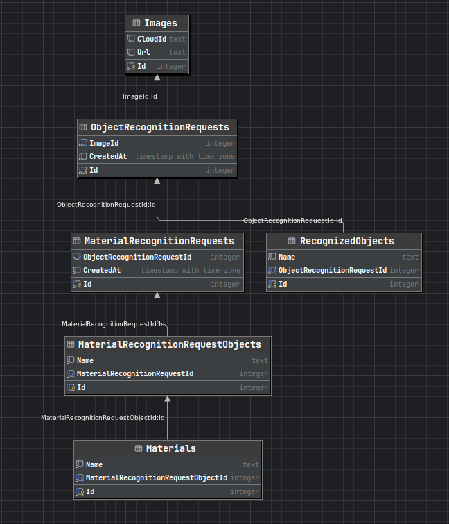

# ObjectRecognition
API для определения основных объектов и их материалов на изображениях

## Содержание
- [Порядок запуска](#порядок-запуска)
- [Описание API](#описание-api)
- [Описание решения](#описание-решения)
- [Схема базы данных](#схема-базы-данных)
- [Промпты](#промпты)

## Порядок запуска

1) Добавить в файл .env необходимые ключи для авторизации
Пример записи для GigaChat (о том, как получить данный ключ, можно прочитать [здесь](https://developers.sber.ru/docs/ru/gigachat/quickstart/ind-using-api#poluchenie-avtorizatsionnyh-dannyh)):
```
GIGACHAT_AUTHORIZATION_KEY=<TOKEN>
```

2) Запустить docker compose
```
docker compose up -d
```

3) Перейти на http://localhost:8080/reference для тестирования ([Scalar API Reference](https://github.com/scalar/scalar))

## Описание API

#### POST `/recognition/getMainObjects`
Определение основных объектов на изображении

Параметры запроса:
- `imageUrl`: URL изображения

#### POST `/recognition/getMaterialsOfMainObjects/{requestId}`
Определение материалов основных объектов на изображении

Параметры запроса:
- `requestId`: id запроса на определение основных объектов на изображении
- `objects`: список названий объектов для анализа (должны присутствовать на изображении; если список не передан, используются объекты указанного запроса)

## Описание решения
### Архитектура
- Domain - доменные сущности
- Application - бизнес-правила, интерфейсы, DTO
- Infrastructure - внешние сервисы и зависимости, реализации
 - Persistence - хранение объектов (БД)
 - Vlm - реализации логики для конкретных провайдеров VLM
- API - интерфейс взаимодействия через HTTP

### Особенности
- Использование [Refit](https://github.com/reactiveui/refit) для удобного обращения к внешним ресурсам
- Возможность подключения любого VLM-провайдера без изменений бизнес-логики

### Схема базы данных
<a href="assets/schema.png">
  
</a>

### Сущности
ObjectRecognitionRequest - запрос на определение основных объектов на изображении

RecognizedObject - объект, найденный на изображении

MaterialRecognitionRequest - запрос на определение материалов объектов на изображении

MaterialRecognitionRequestObject - объект, материалы которого были определены

Material - материал объекта, присутствующего на изображении

Image - изображение, загруженное на сервер для использования VLM

## Промпты
Определение основных объектов на изображении
> Ты - эксперт по определению основных предметов на изображениях. Твоя задача: определить основной предмет или основные предметы на изображении, вернуть названия объектов максимально конкретно (самый узкий корректный класс, пример: не "лампа", а "лампа настольная"). Не указывай бренд, модель. Как определить основной предмет (или предметы): объект занимает заметную площадь кадра, детализирован, хорошо виден, не является частью фона, расположен в зоне внимания. Формат ответа: только JSON массив строк - названий основных предметов (как текст, не в блоке кода), без комментариев к нему. Если основных предметов нет или произошла ошибка - верни []

Определение материалов объектов на изображении
> Ты - эксперт по определению материалов предметов на изображении. Тебе дано изображение и список предметов. Твоя задача - для каждого объекта из списка, который действительно присутствует на изображении, указать максимально полный список материалов, из которых он состоит. Учитывай не только внешний материал, но и вероятные внутренние материалы. Обращай внимание на визуальные признаки, не ограничивайся одним материалом, если объект обычно состоит из нескольких. Если объекта нет на изображении - пропусти его и не указывай в ответе. Если объект есть, но материалы определить не удаётся - верни пустой массив Materials для этого объекта. Формат ответа: JSON массив объектов (как текст, не в блоке кода) вида { "ObjectName": "имя предмета", "Materials": ["материал1", "материал2"] }. Если произошла ошибка - верни []
